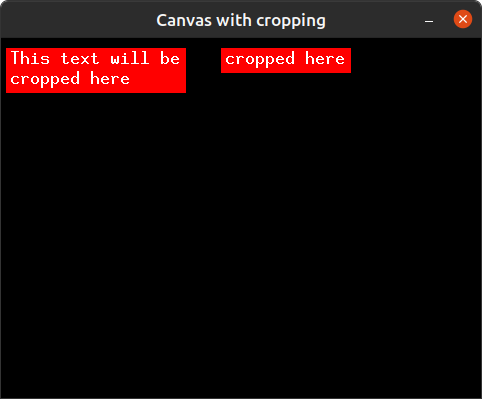

# `embedded-canvas`
[![sponsor-us]](https://github.com/sponsors/LechevSpace)&ensp;[![crates-io]](https://crates.io/crates/embedded-canvas)&ensp;[![docs-rs]](https://docs.rs/embedded-canvas)

> canvas - a piece of cloth backed or framed as a surface for a painting

_**NOTE:** This crate is still in development and may have breaking changes from
one version to another._

`embedded-canvas` is a convenient crate for [`embedded-graphics`]
and provides a [`Canvas`](#canvas) and [`CanvasAt`](#canvasat) on which you
can draw anything with ease before drawing the pixels on the embedded display.

Based on [`embedded-graphics-core`] and [`embedded-graphics`]
(see `transform` feature in [Crate features](#crate-features)).

This crate is `no_std` and it has 2 sets of canvases:

- `Canvas` and `CanvasAt` - require `alloc` feature
- `CCanvas` and `CCanvasAt` - do **not** require `alloc` feature because they
   use const generics instead.

The main advantages of the canvases in this crate are:

1. **Transparency** - pixels that haven't been drawn, won't override pixels on the display.

_Example: Transparency - The canvas content (a circle) is drawn on the display where
there's already a drawn square._

2. **Cropping** - The ability to crop leaves only the part of the canvas you want to
  draw on the display. This is especially useful when you want to
  partially show text, figures and images.

_Example: Cropping text - The full canvas content is drawn on the left and
only portion of it is cropped and drawn on the right._

[crates-io]: https://img.shields.io/crates/v/embedded-canvas?logo=rust&style=for-the-badge
[docs-rs]: https://img.shields.io/badge/docs.rs-66c2a5?style=for-the-badge&labelColor=555555&logoColor=white&logo=data:image/svg+xml;base64,PHN2ZyByb2xlPSJpbWciIHhtbG5zPSJodHRwOi8vd3d3LnczLm9yZy8yMDAwL3N2ZyIgdmlld0JveD0iMCAwIDUxMiA1MTIiPjxwYXRoIGZpbGw9IiNmNWY1ZjUiIGQ9Ik00ODguNiAyNTAuMkwzOTIgMjE0VjEwNS41YzAtMTUtOS4zLTI4LjQtMjMuNC0zMy43bC0xMDAtMzcuNWMtOC4xLTMuMS0xNy4xLTMuMS0yNS4zIDBsLTEwMCAzNy41Yy0xNC4xIDUuMy0yMy40IDE4LjctMjMuNCAzMy43VjIxNGwtOTYuNiAzNi4yQzkuMyAyNTUuNSAwIDI2OC45IDAgMjgzLjlWMzk0YzAgMTMuNiA3LjcgMjYuMSAxOS45IDMyLjJsMTAwIDUwYzEwLjEgNS4xIDIyLjEgNS4xIDMyLjIgMGwxMDMuOS01MiAxMDMuOSA1MmMxMC4xIDUuMSAyMi4xIDUuMSAzMi4yIDBsMTAwLTUwYzEyLjItNi4xIDE5LjktMTguNiAxOS45LTMyLjJWMjgzLjljMC0xNS05LjMtMjguNC0yMy40LTMzLjd6TTM1OCAyMTQuOGwtODUgMzEuOXYtNjguMmw4NS0zN3Y3My4zek0xNTQgMTA0LjFsMTAyLTM4LjIgMTAyIDM4LjJ2LjZsLTEwMiA0MS40LTEwMi00MS40di0uNnptODQgMjkxLjFsLTg1IDQyLjV2LTc5LjFsODUtMzguOHY3NS40em0wLTExMmwtMTAyIDQxLjQtMTAyLTQxLjR2LS42bDEwMi0zOC4yIDEwMiAzOC4ydi42em0yNDAgMTEybC04NSA0Mi41di03OS4xbDg1LTM4Ljh2NzUuNHptMC0xMTJsLTEwMiA0MS40LTEwMi00MS40di0uNmwxMDItMzguMiAxMDIgMzguMnYuNnoiPjwvcGF0aD48L3N2Zz4K
[sponsor-us]: https://img.shields.io/github/sponsors/LechevSpace?color=bf3989&label=Sponsor%20us&style=for-the-badge&logoColor=bf3989&logo=data%3Aimage%2Fsvg%2Bxml%3Bbase64%2CPHN2ZyBoZWlnaHQ9IjE2IiB2aWV3Qm94PSIwIDAgMTYgMTYiIHZlcnNpb249IjEuMSIgd2lkdGg9IjE2IiB4bWxucz0iaHR0cDovL3d3dy53My5vcmcvMjAwMC9zdmciPgogICAgPHBhdGggZmlsbD0iI2JmMzk4OSIgZmlsbC1ydWxlPSJldmVub2RkIiBkPSJNNC4yNSAyLjVjLTEuMzM2IDAtMi43NSAxLjE2NC0yLjc1IDMgMCAyLjE1IDEuNTggNC4xNDQgMy4zNjUgNS42ODJBMjAuNTY1IDIwLjU2NSAwIDAwOCAxMy4zOTNhMjAuNTYxIDIwLjU2MSAwIDAwMy4xMzUtMi4yMTFDMTIuOTIgOS42NDQgMTQuNSA3LjY1IDE0LjUgNS41YzAtMS44MzYtMS40MTQtMy0yLjc1LTMtMS4zNzMgMC0yLjYwOS45ODYtMy4wMjkgMi40NTZhLjc1Ljc1IDAgMDEtMS40NDIgMEM2Ljg1OSAzLjQ4NiA1LjYyMyAyLjUgNC4yNSAyLjV6TTggMTQuMjVsLS4zNDUuNjY2LS4wMDItLjAwMS0uMDA2LS4wMDMtLjAxOC0uMDFhNy42NDMgNy42NDMgMCAwMS0uMzEtLjE3IDIyLjA3NSAyMi4wNzUgMCAwMS0zLjQzNC0yLjQxNEMyLjA0NSAxMC43MzEgMCA4LjM1IDAgNS41IDAgMi44MzYgMi4wODYgMSA0LjI1IDEgNS43OTcgMSA3LjE1MyAxLjgwMiA4IDMuMDIgOC44NDcgMS44MDIgMTAuMjAzIDEgMTEuNzUgMSAxMy45MTQgMSAxNiAyLjgzNiAxNiA1LjVjMCAyLjg1LTIuMDQ1IDUuMjMxLTMuODg1IDYuODE4YTIyLjA4IDIyLjA4IDAgMDEtMy43NDQgMi41ODRsLS4wMTguMDEtLjAwNi4wMDNoLS4wMDJMOCAxNC4yNXptMCAwbC4zNDUuNjY2YS43NTIuNzUyIDAgMDEtLjY5IDBMOCAxNC4yNXoiPjwvcGF0aD4KPC9zdmc%2BCg%3D%3D

[`embedded-graphics`]: https://crates.io/crates/embedded-graphics
[`embedded-graphics-core`]: https://crates.io/crates/embedded-graphics-core
## How to work with canvases

There are **two** main canvases you can work with:

### `Canvas` / `CCanavas`

A canvas which you can draw on with origin `Point::zero()`.
The canvas location is not set for the provided display.

After drawing decide where to place it on the display using the methods:
- `Canvas::place_at(top_left: Point) -> CanvasAt` (with `alloc` feature) or `CCanvas::place_at(top_left: Point) -> CCanvasAt`
- `Canvas::place_center(center: Point) -> CanvasAt` (with `alloc` feature) or `CCanvas::place_center(center: Point) -> CCanvasAt`

### `CanvasAt` / `CCanvasAt`

`CanvasAt`/`CCanvasAt` are a type of canvas ready to be drawn on the display at specified
location (hence the name `CanvasAt`/`CCanvasAt`).

There are two ways of using `CanvasAt`/`CCanvasAt`:

1. Directly placing the `CanvasAt`/`CCanavasAt` on specified location on the display and drawing inside.
2. Create a `Canvas`/`CCanvas` and when ready to draw it on the display place the
  `Canvas`/`CCanvas` at specified location using the methods:
   - `Canvas::place_at(top_left: Point) -> CanvasAt` (with `alloc` feature) and `CCanvas::place_at(top_left: Point) -> CCanvasAt`
   - `Canvas::place_center(center: Point) -> CanvasAt` (with `alloc` feature) and `CCanvas::place_center(center: Point) -> CCanvasAt`

## Crate features
- `default` features - `transform`
- `alloc` - enables `Canvas` and `CanvasAt`.
- `transform` - enables the trait implementation of [`embedded_graphics::transform::Transform`] for `CanvasAt`.

[`embedded_graphics::transform::Transform`]: https://docs.rs/embedded-graphics/latest/embedded_graphics/transform/trait.Transform.html

## License

Licensed under either of [Apache License, Version 2.0](./LICENSE-APACHE)
or [MIT license](./LICENSE-MIT) at your option.

### Contribution

Unless you explicitly state otherwise, any contribution intentionally submitted
for inclusion in this project by you, as defined in the Apache-2.0 license,
shall be dual licensed as above, without any additional terms or conditions.